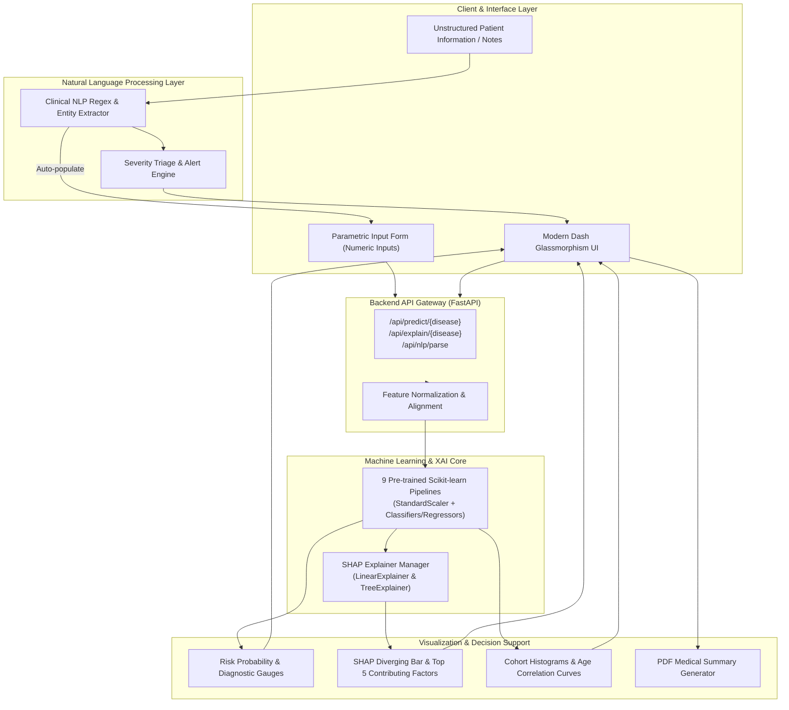

<div align="center">

# 🩺 Aegis AI | Clinical Intelligence & Multi-Disease Diagnostic System

[](https://www.python.org/)
[](https://fastapi.tiangolo.com/)
[](https://dash.plotly.com/)
[](https://scikit-learn.org/)
[](https://shap.readthedocs.io/)
[](https://www.sqlite.org/)
[](LICENSE)

<p align="center">
  <b>Enterprise AI healthcare diagnosis platform featuring disease-agnostic Clinical NLP parameter extraction, Explainable AI (SHAP) feature attribution, and predictive intelligence across 9 major pathological conditions.</b>
</p>

[Key Features](#-key-features) •
[Architecture](#-system-architecture) •
[Disease Models](#-supported-disease-modules) •
[Explainable AI (SHAP)](#-explainable-ai-xai--shap-engine) •
[NLP Parameter Extraction](#-clinical-nlp-extraction) •
[Getting Started](#-getting-started) •
[API Reference](#-rest-api-reference)

</div>

---

## 🌟 Executive Overview

**Aegis AI** is an advanced clinical decision support system designed to bridge the gap between unstructured physician notes, empirical patient biometrics, and state-of-the-art machine learning inference. Built for healthcare professionals, clinical researchers, and diagnostic workflows, the system provides transparent, explainable, and instantaneous risk stratification across multiple disease domains.

Unlike "black-box" diagnostic tools, Aegis AI pairs **Shapley Additive exPlanations (SHAP)** with deep domain heuristics to deliver exact feature attributions—clarifying precisely *why* an assessment was made, which biomarkers drove elevated risk, and which metrics served as protective factors.

---

## 🚀 Key Features

- **🌐 9 Comprehensive Disease Diagnostic Modules**:
  - Diabetes Mellitus (ADA Guidelines)
  - Cardiovascular Disease / Heart Failure
  - Cerebrovascular Stroke
  - Chronic Kidney Disease (Renal Filtration)
  - Hepatic / Liver Dysfunction
  - Hematological Anemia (Hb Oxygenation)
  - Hypertension & Arterial Pressure
  - Metabolic Obesity & Body Composition
  - Systemic Multi-Factor General Health Wellness

- **📝 Disease-Agnostic Clinical NLP Parameter Extraction**:
  - Ingests raw doctor notes, triage narratives, or patient self-reports.
  - Automatically identifies, extracts, and validates biometrics across all supported diseases (blood pressure, fasting glucose, lipid panels, BMI, pulse, hemoglobin, bilirubin, etc.).
  - Auto-populates dashboard input fields and immediately initiates multi-model diagnostic inference.
  - Generates automated clinical triage severity scoring (`Routine`, `Elevated`, `Urgent`, `Critical Alert`).

- **🧠 Explainable AI (XAI) with SHAP**:
  - Transparent model-level and prediction-level interpretability.
  - `shap.LinearExplainer` for standardized linear and logistic models.
  - `shap.TreeExplainer` for non-linear tree-based ensembles (Random Forest, Gradient Boosting).
  - Dynamic Plotly diverging horizontal bar charts visualizing exact feature contributions (`+` increases risk, `-` mitigates risk).
  - Top 5 primary risk factors breakdown with patient-specific clinical rationale narratives.

- **📊 Deep Biometric & Cohort Analytics**:
  - **Clinical Status Gauge**: Real-time risk scoring and model confidence metrics.
  - **Biometric Multi-Axis Radar**: Visualizes multi-dimensional physiological deviations from healthy norms.
  - **Clinical Reference Index**: Benchmarks patient vitals against established WHO/AHA/ADA upper reference thresholds.
  - **Population Cohort Distributions**: Real-time histogram & kernel density comparisons against cohort databases.
  - **Age-Risk Correlation Curves**: Polynomial risk trajectories contextualizing the patient within their demographic bracket.

- **🔒 Enterprise Security & Access Control**:
  - Google OAuth 2.0 single sign-on integration.
  - Sandbox Demo Mode for rapid evaluation without cloud credentials.
  - Persistent SQLite patient registry and historical assessment logging.

---

## 🏗 System Architecture



---

## 🔬 Supported Disease Modules

| Disease Module | Target Condition | Clinical Reference Standards | Key Biometric Inputs | SHAP Explainer |
|---|---|---|---|---|
| **Diabetes** | Diabetes Mellitus Risk | American Diabetes Association (ADA) | Glucose, Insulin, BMI, Blood Pressure, Pregnancies, Pedigree, Age | `LinearExplainer` |
| **Heart Disease** | Cardiovascular Event / CAD | American Heart Association (AHA) | Resting BP, Cholesterol, Max HR, ST Depression, Chest Pain, Vessels, Age | `LinearExplainer` |
| **Stroke** | Cerebrovascular Event Risk | WHO Stroke Risk Guidelines | Glucose, BMI, Hypertension, Smoking, Heart Disease, Age | `LinearExplainer` |
| **Hypertension (BP)** | Arterial Hypertension | ACC/AHA BP Classifications | Systolic BP, Diastolic BP, Pulse, Cholesterol, Glucose, Activity, Smoking | `LinearExplainer` |
| **Kidney Disease** | Renal Impairment (CKD) | KDIGO Clinical Practice Guidelines | Blood Pressure, Age, Creatinine baselines | `LinearExplainer` |
| **Liver Disease** | Hepatic Dysfunction | AASLD Diagnostic Workups | Total Bilirubin, Age, Hepatic enzyme pathways | `LinearExplainer` |
| **Anemia** | Oxygen-Carrying Capacity | WHO Hemoglobin Guidelines | Hemoglobin concentration, Gender, Age | `LinearExplainer` |
| **Obesity** | Metabolic Weight Index | WHO BMI Classification | Height, Weight, Calculated BMI, Age | `LinearExplainer` |
| **General Health** | Multi-Factor Vitality Index | Standard Preventive Baselines | Age, Vital Signs Composite | `LinearExplainer` |

---

## 🧠 Explainable AI (XAI) & SHAP Engine

Traditional deep learning models often operate as opaque black boxes. In medical diagnostics, explainability is not just a feature—it is an ethical and clinical requirement.

Aegis AI incorporates **Shapley Additive exPlanations (SHAP)** rooted in cooperative game theory:

$$\phi_i(x) = \sum_{S \subseteq F \setminus \{i\}} \frac{|S|!(|F| - |S| - 1)!}{|F|!} \left( f(S \cup \{i\}) - f(S) \right)$$

### Key Explainability Components:
1. **Model-Appropriate Explainers**:
   - `shap.LinearExplainer` handles standardized linear and logistic regression diagnostic pipelines.
   - `shap.TreeExplainer` handles non-linear tree-based models and regressors.
   - Robust fallback synthesizers ensure zero downtime if a model format is unsupported.
2. **Feature-Level Impact Decomposition**:
   - **Positive Impact (`+` red/coral)**: Biomarkers that push the model toward elevated risk (e.g., Blood Glucose = 172 mg/dL adding `+1.71` to diabetes risk).
   - **Negative Impact (`-` teal/cyan)**: Biomarkers that serve as protective factors, reducing risk (e.g., normal blood pressure or active lifestyle).
3. **Dynamic Clinical Narratives**:
   - The engine translates numerical Shapley vectors into natural language diagnostic summaries (e.g., *"Higher Blood Glucose (172.0) contributed strongly to predicted risk (+1.71). Optimal Genetic Pedigree Score acted as a protective factor."*).

---

## 📝 Clinical NLP Extraction

The system includes a powerful, disease-agnostic Natural Language Processing component that extracts numerical vitals and clinical entities directly from free-form text.

### Example Unstructured Input:
```text
54-year-old female patient presenting with resting BP 142/88 mmHg, 
fasting blood sugar 172 mg/dL, BMI 31.8, insulin 145 mU/L, 
2 prior pregnancies, and maternal history of diabetes. 
Reports fatigue and blurred vision.
```

### Extracted Parameters & Actions:
- **Age**: 54 years
- **Gender**: Female
- **Blood Pressure**: 142/88 mmHg (`systolic: 142`, `diastolic: 88`)
- **Glucose**: 172 mg/dL
- **BMI**: 31.8
- **Insulin**: 145 mU/L
- **Pregnancies**: 2
- **Triage Assessment**: `Elevated Monitoring` (Action: Schedule diagnostic workup and glucose tolerance test)
- **Automatic Execution**: Populates all parametric inputs in the dashboard and executes the prediction + SHAP pipeline simultaneously.

---

## 💻 Getting Started

### Prerequisites
- Python 3.11 or higher
- Git

### 1. Clone the Repository
```bash
git clone https://github.com/AshuKumari21/AI-Healthcare-Diagnosis-System.git
cd AI-Healthcare-Diagnosis-System
```

### 2. Set Up Virtual Environment
```bash
python -m venv venv

# Windows (PowerShell)
.\venv\Scripts\Activate.ps1

# Linux / macOS
source venv/bin/activate
```

### 3. Install Dependencies
```bash
pip install -r requirements.txt
```

### 4. Configure Environment Variables
Create a `.env` file in the root directory (optional for demo mode, required for Google OAuth & live email):

```env
# Server Port
PORT=8000

# Google OAuth Credentials (Optional - use Demo Login if omitted)
GOOGLE_CLIENT_ID=your_google_client_id.apps.googleusercontent.com
GOOGLE_CLIENT_SECRET=your_google_client_secret

# Security Key
FLASK_SECRET_KEY=a-secure-random-secret-key-for-session

# Contact Form SMTP (Optional)
GMAIL_USER=your_email@gmail.com
GMAIL_APP_PASSWORD=your_gmail_app_password
```

### 5. Launch the Application
Run the unified production server (serves FastAPI + Dash simultaneously on port 8000):

```bash
python run_prod.py
```

Open your browser and navigate to:
- **Interactive Clinical Dashboard**: [http://127.0.0.1:8000/](http://127.0.0.1:8000/)
- **Instant Demo Access**: [http://127.0.0.1:8000/login/google/demo](http://127.0.0.1:8000/login/google/demo)
- **Interactive REST API Documentation (Swagger)**: [http://127.0.0.1:8000/docs](http://127.0.0.1:8000/docs)

---

## 📡 REST API Reference

The backend exposes fully documented OpenAPI/Swagger endpoints:

### Prediction with SHAP Explanation
`POST /api/predict/{disease}`

```bash
curl -X POST "http://127.0.0.1:8000/api/predict/diabetes" \
  -H "Content-Type: application/json" \
  -d '{
    "features": {
      "Glucose": 172.0,
      "BloodPressure": 88,
      "BMI": 31.8,
      "Insulin": 145.0,
      "Age": 54,
      "Pregnancies": 2
    }
  }'
```

**Response Payload**:
```json
{
  "disease": "diabetes",
  "prediction": 1,
  "probability": 64.54,
  "status": "High Risk",
  "features_used": 8,
  "mapping_status": "named",
  "explanation": {
    "success": true,
    "disease": "diabetes",
    "explainer_type": "LinearExplainer",
    "primary_driver": "Blood Glucose",
    "top_5_contributing": [
      {
        "feature_name": "Glucose",
        "display_name": "Blood Glucose",
        "recorded_value": 172.0,
        "shap_value": 1.7118,
        "direction": "positive",
        "impact_formatted": "+1.71"
      },
      {
        "feature_name": "Age",
        "display_name": "Patient Age",
        "recorded_value": 54.0,
        "shap_value": 0.773,
        "direction": "positive",
        "impact_formatted": "+0.77"
      }
    ],
    "clinical_explanation": [
      "Higher Blood Glucose (172.0) contributed strongly to the predicted risk (+1.71).",
      "Patient Age (54.0) also contributed positively to the risk prediction (+0.77)."
    ]
  }
}
```

### Dedicated Explanation Endpoint
`POST /api/explain/{disease}`
- Returns isolated SHAP vectors, baseline expected value, positive factors, and negative mitigators for custom integration.

### Clinical NLP Parsing Endpoint
`POST /api/nlp/parse`
- Extracts biometric entities, symptoms, triage rating, and recommended diagnostic modules from unstructured clinical text.

---

## 📁 Repository Structure

```text
AI-Healthcare-Diagnosis-System/
├── api/
│   └── main.py                     # FastAPI REST API, model loading, SHAP integration
├── dashboard/
│   ├── app.py                      # Dash application, interactive callbacks, XAI charts
│   └── assets/                     # Custom dark-theme glassmorphism CSS, branding logos
├── db/
│   ├── database.py                 # SQLite database: users, history, seed cohort data
│   └── aegis_health.db             # Local database file
├── ml/
│   ├── models/                     # 9 pre-trained scikit-learn disease classifier pipelines
│   ├── nlp/
│   │   ├── clinical_parser.py      # Regex entity extraction, triage evaluation, vital mapping
│   │   ├── patient_analytics.py    # Reference intervals, cohort correlation & distribution plots
│   │   └── assistant.py            # Clinical guidance assistant logic
│   └── xai/
│       ├── explainer.py            # SHAP LinearExplainer, TreeExplainer, narrative generator
│       └── visualizer.py           # Plotly horizontal diverging bar figure, XAI dashboard cards
├── test_pipeline.py                # Automated end-to-end multi-disease verification test
├── run_prod.py                     # Production entrypoint mounting Dash inside FastAPI
├── requirements.txt                # Project dependencies (FastAPI, Dash, SHAP, Scikit-learn)
├── render.yaml                     # Cloud deployment configuration
└── README.md                       # Comprehensive system documentation
```

---

## ⚕️ Clinical Decision Support Notice

> [!IMPORTANT]
> **Aegis AI** is developed as an intelligent Clinical Decision Support System (CDSS) intended to assist qualified healthcare professionals by providing biometric stratification and predictive guidance. All algorithmic findings, risk probabilities, and SHAP feature attributions must be evaluated in conjunction with professional clinical judgment and diagnostic laboratory testing.

---

## 📜 License

This project is licensed under the MIT License - see the [LICENSE](LICENSE) file for details.

<div align="center">
  <sub>Developed with ❤️ for advancing clinical artificial intelligence and transparent healthcare workflows.</sub>
</div>
